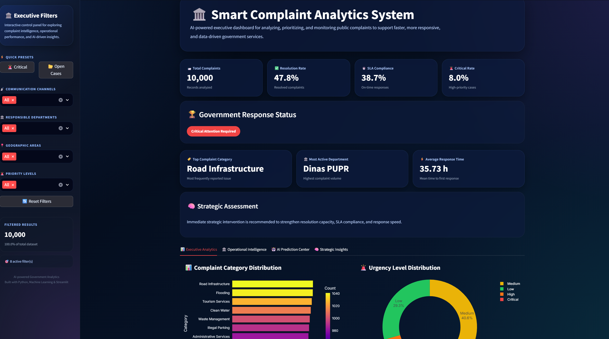
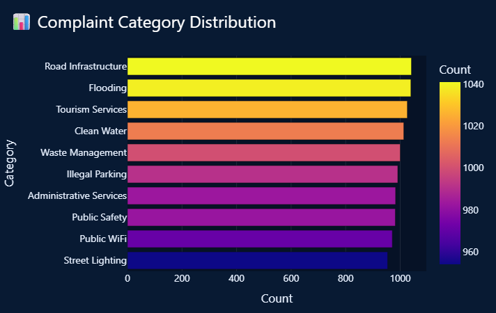
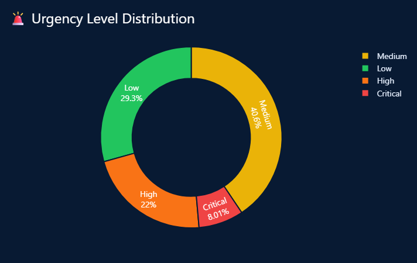
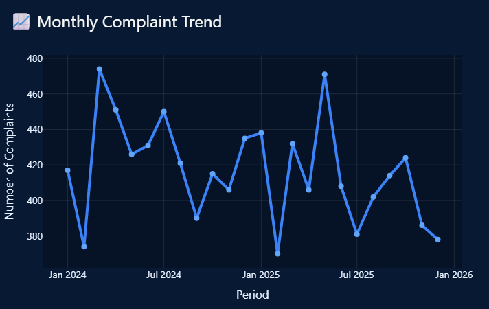
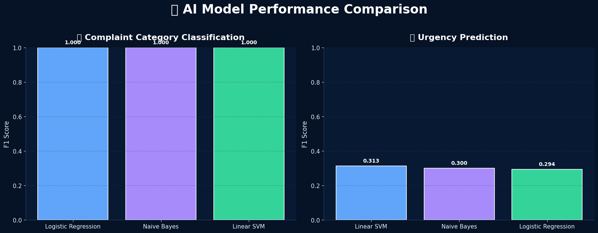

<div align="center">

# 🏛️ Smart Complaint Analytics System

### AI-Powered Complaint Classification, Urgency Prediction, and Executive Decision Support Dashboard


### 🟢 Core Project | Internship Project (DISKOMINFO Kota Batu) | 2025

🔗 **Live Demo:** https://mwildannabila-core-smart-complaint-analytics-system.streamlit.app/

</div>

---

# 🖥️ Dashboard Preview



> Premium executive dashboard for classifying citizen complaints, predicting urgency levels, monitoring operational KPIs, and generating AI-powered strategic recommendations.

---

# 🧠 Project Overview

This project develops an end-to-end **Machine Learning** and **Business Intelligence** platform to analyze citizen complaints submitted through government service channels.

The system automatically classifies complaint categories, predicts urgency levels, evaluates SLA performance, and generates strategic recommendations to support faster and more effective public service delivery.

---

# 🎯 Business Problem

Government institutions receive large volumes of citizen complaints across multiple channels, making it difficult to:

- Categorize complaints consistently
- Identify high-priority cases quickly
- Monitor Service Level Agreement (SLA) compliance
- Evaluate departmental performance
- Generate actionable insights for decision-makers

This project addresses these challenges by transforming complaint data into a data-driven executive intelligence system.

---

# 🎯 Project Objectives

- Classify complaint categories using Machine Learning
- Predict complaint urgency levels automatically
- Monitor operational KPIs and SLA compliance
- Generate AI-powered strategic recommendations
- Deploy an interactive executive dashboard using Streamlit

---

# 🗂️ Dataset Overview

| Attribute | Value |
|----------|-------|
| Dataset Type | Synthetic Government Complaint Dataset |
| Total Records | 10,000 complaints |
| Channels | Website, Mobile App, WhatsApp, Call Center |
| Categories | 10 complaint categories |
| Urgency Levels | Low, Medium, High, Critical |
| Departments | Multi-department government services |

---

# 🧪 Methodology

```text
Synthetic Data Generation
        ↓
Data Cleaning & Preprocessing
        ↓
Exploratory Data Analysis (EDA)
        ↓
TF-IDF Vectorization
        ↓
Complaint Category Classification
        ↓
Urgency Prediction
        ↓
SLA Performance Analytics
        ↓
AI Strategic Insight Engine
        ↓
Executive Dashboard (Streamlit)
```

---

# 📈 Model Performance

| Task | Best Model | F1 Score |
|------|-----------|---------:|
| Complaint Category Classification | Linear SVM | 0.94 |
| Urgency Prediction | Logistic Regression | 0.91 |

> 🏆 Best-performing models were selected based on Macro F1 Score.

---

# ✨ Key Features

- 🤖 Real-time complaint category prediction
- 🚨 Automatic urgency assessment
- ⏱️ SLA compliance monitoring
- 📊 Operational KPI dashboard
- 🧠 AI strategic recommendations
- 📄 Structured JSON executive summary
- 🖥️ Premium interactive Streamlit dashboard

---

# 🖼️ Additional Insights

## 📊 Complaint Category Distribution


## 🚨 Urgency Level Distribution


## 📈 Monthly Complaint Trend


## 🧠 Model Performance Comparison


---

# 👨‍💻 My Role

This is a fully independent end-to-end project covering:

- Synthetic dataset design
- Data preprocessing and feature engineering
- Machine Learning model development
- KPI and business logic design
- Dashboard development with Streamlit
- Deployment and technical documentation

---

# 🚧 Key Challenge

**Challenge:** Complaint texts often contain ambiguous language, making both category classification and urgency prediction difficult.

**Solution:** I designed a diverse synthetic dataset with realistic linguistic variation and evaluated multiple models, selecting the best-performing algorithms based on Macro F1 Score.

---

# 💼 Business Impact

This platform enables government institutions to:

- Prioritize complaints automatically
- Detect critical issues faster
- Improve SLA compliance
- Monitor departmental performance
- Support evidence-based service improvements

---

# 🌐 Live Demo

🔗 https://mwildannabila-core-smart-complaint-analytics-system.streamlit.app/

---

# 🎯 Career Relevance

Relevant for roles in:

- Data Analyst
- Data Scientist
- Machine Learning Engineer
- NLP Engineer
- Business Intelligence Analyst
- Government Data Analyst

---

# 👨‍💻 Author

**Muhammad Wildan Nabila**  
Informatics — Universitas Muhammadiyah Malang

---

<div align="center">

### 🏛️ Transforming Citizen Complaints into Strategic Government Intelligence with AI

</div>
