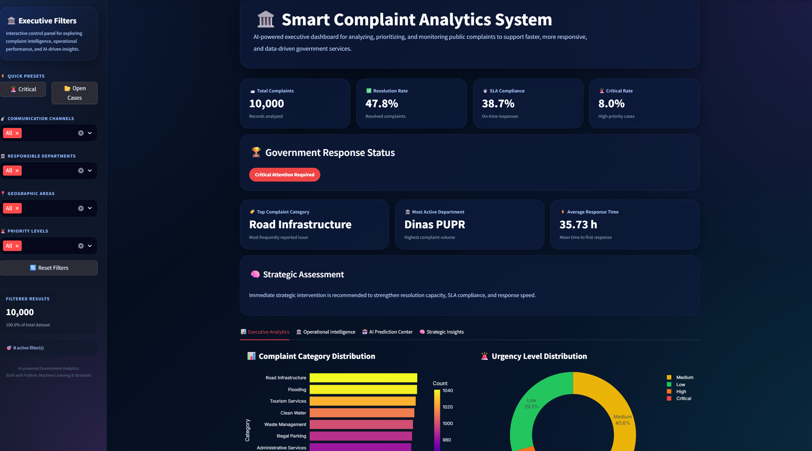
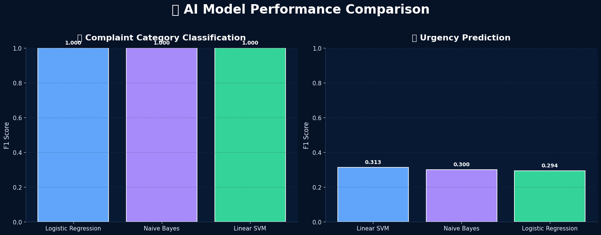
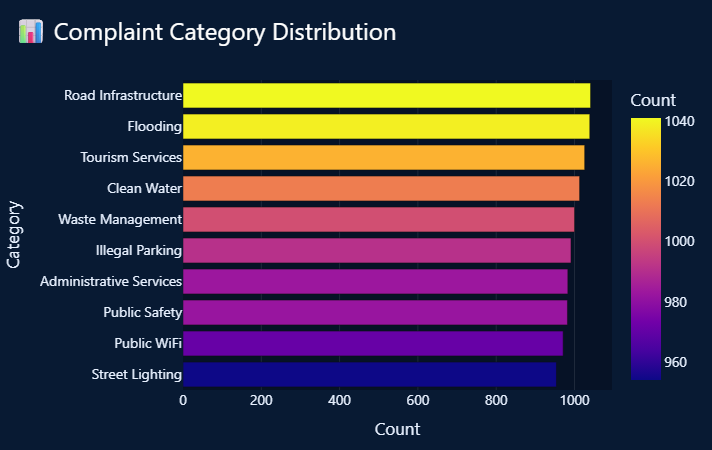
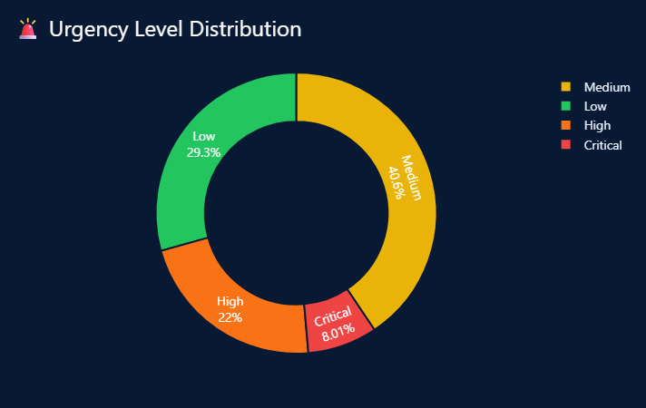
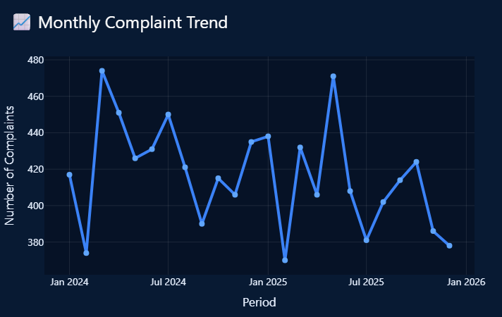

<div align="center">

# Smart Complaint Analytics System

### NLP · Complaint Classification · Urgency Triage · SLA Analytics

**End-to-End Complaint Intelligence Prototype for Public-Service Operations**

<br>


<br>


<br><br>

**Classify → Prioritize → Monitor → Review**

<br>

[](https://mwildannabila-core-smart-complaint-analytics-system.streamlit.app/)

</div>

---

## Project at a Glance

<table>
<tr>
<td align="center" width="20%">
<strong>10,000</strong><br>
Synthetic Complaints
</td>
<td align="center" width="20%">
<strong>10</strong><br>
Complaint Categories
</td>
<td align="center" width="20%">
<strong>4</strong><br>
Urgency Levels
</td>
<td align="center" width="20%">
<strong>0.94</strong><br>
Category Macro F1
</td>
<td align="center" width="20%">
<strong>0.91</strong><br>
Urgency Macro F1
</td>
</tr>
</table>

> **Project focus:** Transforming complaint text and operational data into structured categories, urgency signals, SLA indicators, and interactive public-service decision support.

> **Important:** The system uses a **synthetic government complaint dataset** and is presented as an analytical prototype. Results should not be interpreted as validated performance on real citizen complaints or as an official government complaint-management system.

---

# Operational Problem

Public-service complaint systems can receive large volumes of unstructured reports through multiple communication channels.

Each complaint may require several operational decisions:

```text
Complaint Received
       │
       ├── What is the complaint about?
       ├── Which category does it belong to?
       ├── How urgent might it be?
       ├── Which cases require attention first?
       └── Is the handling process meeting SLA targets?
```

Manual processing can become difficult as complaint volume increases.

This project explores how **Natural Language Processing and operational analytics** can structure that workflow.

```text
Unstructured Complaint
         │
         ▼
     NLP Processing
         │
    ┌────┴──────────────┐
    ▼                   ▼
Category             Urgency
Classification       Classification
    │                   │
    └─────────┬─────────┘
              ▼
       Operational Context
              │
              ▼
        SLA Monitoring
              │
              ▼
         Human Review
              │
              ▼
      Decision Support
```

---

# Live Application

<div align="center">

[](https://mwildannabila-core-smart-complaint-analytics-system.streamlit.app/)

</div>

The deployed prototype combines:

`Complaint Analytics` · `Category Classification` · `Urgency Triage` · `SLA Monitoring` · `Operational KPIs` · `Interactive Prediction`

within a unified Streamlit interface.

---

# Executive Dashboard

<p align="center">
  
</p>

The dashboard provides an operational overview of simulated complaint activity.

<table>
<tr>
<td align="center" width="25%">
<strong>Volume</strong><br>
Complaint Monitoring
</td>
<td align="center" width="25%">
<strong>Category</strong><br>
Issue Distribution
</td>
<td align="center" width="25%">
<strong>Urgency</strong><br>
Priority Signals
</td>
<td align="center" width="25%">
<strong>SLA</strong><br>
Service Performance
</td>
</tr>
</table>

---

# Dataset & Analytical Scope

| Dimension | Scope |
|---|---|
| **Dataset** | Synthetic Government Complaint Dataset |
| **Records** | **10,000 simulated complaints** |
| **Channels** | Website · Mobile App · WhatsApp · Call Center |
| **Complaint categories** | **10 categories** |
| **Urgency levels** | Low · Medium · High · Critical |
| **Organizational scope** | Multiple simulated departments |
| **Text representation** | TF-IDF |
| **Primary tasks** | Category & Urgency Classification |
| **Operational layer** | SLA & KPI Analytics |

### Why Synthetic Data?

Synthetic data allows the complete complaint-intelligence workflow to be demonstrated without exposing real citizen complaint records.

It also enables controlled experimentation across categories and urgency levels.

However:

> **Performance on synthetic complaints does not establish equivalent performance on naturally occurring citizen reports.**

---

# End-to-End Architecture

```text
                    COMPLAINT DATA
                          │
                          ▼
                 DATA VALIDATION
                          │
                          ▼
               CLEANING & PREPROCESSING
                          │
                          ▼
                  TF-IDF FEATURES
                          │
             ┌────────────┴────────────┐
             ▼                         ▼
     CATEGORY PIPELINE          URGENCY PIPELINE
             │                         │
             ▼                         ▼
        Linear SVM          Logistic Regression
             │                         │
             ▼                         ▼
     Category Prediction       Urgency Prediction
             │                         │
             └────────────┬────────────┘
                          ▼
                  OPERATIONAL LAYER
                          │
              ┌───────────┼───────────┐
              ▼           ▼           ▼
            SLA          KPI        Trends
              │           │           │
              └───────────┼───────────┘
                          ▼
                     HUMAN REVIEW
                          │
                          ▼
                  DECISION SUPPORT
```

This separates **model predictions** from the final operational decision.

---

# Complaint Category Classification

The first NLP task determines which complaint category best matches a submitted text.

```text
Citizen Complaint
       │
       ▼
Text Preprocessing
       │
       ▼
TF-IDF Vectorization
       │
       ▼
Linear SVM
       │
       ▼
Complaint Category
```

The classification layer can help structure unorganized complaint text into predefined operational categories.

---

# Category Classification Performance

<div align="center">


</div>

### Macro F1 = **0.94**

Linear SVM achieved the strongest reported Macro F1 score for complaint-category classification.

Macro F1 is particularly useful in multiclass problems because it calculates performance across classes without allowing larger classes to completely dominate the final score.

> The result reflects performance on the project's synthetic dataset and should not be interpreted as validated performance on real government complaints.

---

# Urgency Classification

The second task estimates an urgency class:

<div align="center">


</div>

The workflow is:

```text
Complaint
    │
    ▼
Text Features
    │
    ▼
Logistic Regression
    │
    ▼
Urgency Class
    │
    ▼
Priority Signal
    │
    ▼
Human Review
```

Urgency predictions should be treated as **triage signals**, not authoritative decisions about public-service priority.

---

# Urgency Classification Performance

<div align="center">


</div>

### Macro F1 = **0.91**

Logistic Regression achieved the strongest reported Macro F1 score for the urgency-classification task.

The result demonstrates strong separation within the synthetic dataset while remaining subject to synthetic-to-real generalization limitations.

---

# Model Performance

<p align="center">
  
</p>

| NLP Task | Selected Model | Evaluation Metric | Result |
|---|---|---|---:|
| **Complaint Category** | Linear SVM | Macro F1 | **0.94** |
| **Urgency Level** | Logistic Regression | Macro F1 | **0.91** |

The models solve two related but distinct operational questions:

<table>
<tr>
<td width="50%" valign="top">

### Category Model

**What is this complaint about?**

Output:

`1 of 10 complaint categories`

</td>
<td width="50%" valign="top">

### Urgency Model

**How urgently should this complaint be reviewed?**

Output:

`Low · Medium · High · Critical`

</td>
</tr>
</table>

---

# Complaint Distribution

<p align="center">
  
</p>

Category distribution provides a high-level view of which types of simulated complaints occur most frequently.

Potential operational questions include:

- Which categories account for the largest complaint volume?
- Which categories are increasing?
- Which departments may require additional review?
- Are certain categories associated with higher urgency?

---

# Urgency Distribution

<p align="center">
  
</p>

Urgency distribution provides an additional prioritization dimension beyond complaint volume.

```text
Complaint Volume
      │
      ▼
Which issues are frequent?
      │
      +
      │
Urgency Distribution
      │
      ▼
Which cases may need faster review?
```

This distinction matters because the most frequent category is not necessarily the most operationally urgent.

---

# Complaint Trend Analysis

<p align="center">
  
</p>

Temporal analysis helps examine how simulated complaint volume changes over time.

Potential uses include:

- identifying volume spikes,
- comparing periods,
- monitoring recurring patterns,
- and supporting workload planning.

A trend or spike should be treated as an analytical signal requiring contextual investigation rather than automatic evidence of deteriorating service quality.

---

# SLA Analytics

Complaint classification becomes more operationally useful when connected with service-performance monitoring.

```text
Complaint
    │
    ▼
Category + Urgency
    │
    ▼
Handling Process
    │
    ▼
Resolution Time
    │
    ▼
SLA Evaluation
    │
 ┌──┴──────────┐
 ▼             ▼
Within SLA   Exceeded SLA
```

SLA analytics can help structure questions such as:

- How many complaints are resolved within target time?
- Which categories show longer resolution times?
- Which departments show recurring SLA exceptions?
- Are high-urgency cases receiving timely handling?

> SLA thresholds and operational rules in this prototype should be interpreted as part of the simulated analytical framework unless validated against actual institutional service standards.

---

# Three Layers of Complaint Intelligence

<table>
<tr>
<td width="33%" valign="top">

### 1 · Classification

**What is the issue?**

Complaint-category prediction structures unorganized text.

</td>
<td width="33%" valign="top">

### 2 · Triage

**What may require attention first?**

Urgency classification provides prioritization signals.

</td>
<td width="33%" valign="top">

### 3 · Monitoring

**How is service handling performing?**

SLA and KPI analytics provide operational context.

</td>
</tr>
</table>

Together:

```text
CLASSIFY
What is it?
    │
    ▼
TRIAGE
How urgent?
    │
    ▼
MONITOR
How is it handled?
    │
    ▼
REVIEW
What action is appropriate?
```

---

# From Complaint to Operational Decision Support

```text
                    CITIZEN COMPLAINT
                           │
                           ▼
                     NLP PROCESSING
                           │
              ┌────────────┴────────────┐
              ▼                         ▼
           CATEGORY                  URGENCY
              │                         │
              └────────────┬────────────┘
                           ▼
                    PRIORITY CONTEXT
                           │
                           ▼
                     SLA ANALYTICS
                           │
                           ▼
                   OPERATIONAL KPIs
                           │
                           ▼
                      HUMAN REVIEW
                           │
                           ▼
                       ACTION
```

The system is designed as **decision support**, not autonomous public-service decision-making.

---

# Operational Decision-Support Framework

| Analytical Signal | Potential Operational Use |
|---|---|
| High complaint volume | Workload monitoring |
| Repeated category growth | Investigate recurring service issues |
| High/Critical prediction | Prioritize manual review |
| SLA exception | Investigate processing delay |
| Department concentration | Review operational capacity |
| Monthly complaint spike | Investigate contextual causes |
| Category + urgency combination | Support routing and triage |

> These are potential applications of the analytical outputs, not measured improvements in actual government service performance.

---

# Key Technical Challenge

### Challenge

Complaint language can be ambiguous.

A single complaint may contain:

- informal expressions,
- multiple issues,
- incomplete descriptions,
- emotional language,
- contextual references,
- and varying urgency cues.

This creates two different classification problems:

```text
"What is the issue?"
        │
        ▼
CATEGORY CLASSIFICATION

"How urgent is it?"
        │
        ▼
URGENCY CLASSIFICATION
```

### Approach

The project uses a diverse synthetic dataset with linguistic variation and evaluates models using **Macro F1** rather than relying only on overall accuracy.

This is especially relevant for multiclass tasks where class-level performance matters.

---

# Why Macro F1?

Accuracy answers:

> How many predictions were correct overall?

Macro F1 asks a different question:

> How well does the classifier perform when each class receives equal importance?

Conceptually:

```text
F1 Class 1 ─┐
F1 Class 2 ─┤
F1 Class 3 ─┼──► Average ──► Macro F1
...         │
F1 Class N ─┘
```

This makes Macro F1 useful when evaluating multiple complaint categories or urgency levels, particularly when minority classes are operationally important.

---

# Responsible Automation

Automating complaint analytics introduces important limitations.

### Prediction ≠ Final Decision

A model-generated urgency label should not automatically determine whether a citizen receives priority service.

### Critical Cases Require Human Review

Misclassifying a genuinely urgent complaint may have greater consequences than misclassifying a routine case.

### Language Can Be Ambiguous

Short, sarcastic, incomplete, or context-dependent complaints can be difficult for text classifiers.

### Historical Patterns Can Encode Bias

A system trained on operational data may reproduce inconsistencies already present in historical categorization or prioritization.

### Automation Should Support, Not Replace, Accountability

Final routing, escalation, and service decisions should remain subject to institutional procedures and human oversight.

---

# Project Context

This repository is presented as an **independently developed complaint-analytics prototype for public-sector use cases**.

The application uses synthetic data and should not be interpreted as:

- an official DISKOMINFO Kota Batu system,
- an official Pemerintah Kota Batu complaint platform,
- a model trained on actual citizen complaint records,
- or a system deployed for official complaint prioritization.

If the concept was developed from internship-related experience, that experience provides the **problem-domain context**, while the synthetic application remains a separate portfolio implementation.

---

# Project Ownership

### Muhammad Wildan Nabila
**Data Science · NLP · Analytics Engineering**

The independently developed workflow covers:

- Synthetic dataset design
- Data preprocessing
- Text feature engineering
- TF-IDF vectorization
- Category classification
- Urgency classification
- Model comparison
- Macro F1 evaluation
- KPI design
- SLA analytics
- Interactive visualization
- Streamlit application development
- Deployment
- Technical documentation

This project demonstrates the ability to move from:

```text
Operational Problem
        │
        ▼
Data Design
        │
        ▼
NLP Modeling
        │
        ▼
Model Evaluation
        │
        ▼
Operational Analytics
        │
        ▼
Deployed Prototype
```

---

# Technology Ecosystem

<div align="center">


&nbsp;&nbsp;&nbsp;

&nbsp;&nbsp;&nbsp;

&nbsp;&nbsp;&nbsp;

&nbsp;&nbsp;&nbsp;

&nbsp;&nbsp;&nbsp;


<br><br>

`Python` · `Pandas` · `NumPy` · `Scikit-learn` · `TF-IDF` · `Linear SVM` · `Logistic Regression` · `Plotly` · `Streamlit`

</div>

---

# Technical Stack

| Layer | Technology |
|---|---|
| **Programming** | Python |
| **Data Processing** | Pandas · NumPy |
| **Text Representation** | TF-IDF |
| **Category Classification** | Linear SVM |
| **Urgency Classification** | Logistic Regression |
| **Machine Learning** | Scikit-learn |
| **Operational Analytics** | SLA & KPI Analysis |
| **Visualization** | Plotly |
| **Application** | Streamlit |
| **Deployment** | Streamlit Community Cloud |

---

# Skills Demonstrated

<table>
<tr>
<td width="33%" valign="top">

**Natural Language Processing**

- Text Preprocessing
- TF-IDF
- Multiclass Classification
- Complaint Analytics

</td>
<td width="33%" valign="top">

**Machine Learning**

- Model Comparison
- Linear SVM
- Logistic Regression
- Macro F1 Evaluation

</td>
<td width="33%" valign="top">

**Analytics Engineering**

- KPI Design
- SLA Analytics
- Interactive Visualization
- Streamlit Deployment

</td>
</tr>
</table>

---

# Analytical Limitations

### 1 · Synthetic Dataset

All 10,000 complaint records are simulated.

Model performance therefore demonstrates the technical workflow rather than validated performance on real citizen complaints.

### 2 · Synthetic-to-Real Generalization

Real complaints may contain substantially greater linguistic complexity, noise, ambiguity, and local context.

### 3 · Urgency Labels

Urgency is represented through project-defined labels. Real operational prioritization requires validated institutional criteria.

### 4 · SLA Framework

SLA analysis depends on the thresholds and business rules encoded in the prototype.

### 5 · Classification Errors

Even strong Macro F1 scores do not eliminate false positives or false negatives.

### 6 · No Production Monitoring

The application does not establish production-grade drift monitoring, observability, security, or reliability controls.

### 7 · No Demonstrated Service Outcome

The project does not demonstrate causal improvements in response time, SLA compliance, or citizen satisfaction.

---

# Future Development

The strongest next steps include:

- Validation with ethically sourced real complaint data
- Per-class Precision, Recall, and F1 reporting
- Confusion matrix analysis
- Cross-validation
- Probability calibration
- Threshold optimization
- Cost-sensitive urgency classification
- Indonesian transformer models
- IndoBERT comparison
- Multi-label complaint classification
- Named Entity Recognition
- Automated department routing
- Human-in-the-loop escalation
- Explainability analysis
- Model drift monitoring
- SLA alerting
- API-based inference
- Audit logging
- Role-based access control

A more mature operational architecture could evolve toward:

```text
COMPLAINT
    │
    ▼
CATEGORY
What is the issue?
    │
    ▼
ROUTING
Who should handle it?
    │
    ▼
URGENCY
How quickly should it be reviewed?
    │
    ▼
SLA
Is handling on schedule?
    │
    ▼
ESCALATION
Does it require intervention?
    │
    ▼
RESOLUTION
What was the outcome?
```

---

# Project Summary

| Dimension | Implementation |
|---|---|
| **Problem** | Complaint classification & operational triage |
| **Dataset** | **10,000 synthetic complaints** |
| **Categories** | **10** |
| **Urgency Levels** | **4** |
| **Text Features** | TF-IDF |
| **Category Model** | **Linear SVM** |
| **Category Macro F1** | **0.94** |
| **Urgency Model** | **Logistic Regression** |
| **Urgency Macro F1** | **0.91** |
| **Operational Analytics** | SLA · KPI · Trends |
| **Visualization** | Plotly |
| **Application** | Streamlit |
| **Deployment** | **Live Prototype** |
| **Primary Value** | NLP + Operational Decision Support |

---

# Explore the Project

<div align="center">

[](https://mwildannabila-core-smart-complaint-analytics-system.streamlit.app/)

</div>

---

# Author

**Muhammad Wildan Nabila**  
Bachelor of Informatics · Universitas Muhammadiyah Malang

<div align="left">


</div>

---

<div align="center">

### Complaint → Classification → Triage → SLA Monitoring → Human Decision

**Natural Language Processing · Machine Learning · Operational Analytics · Responsible Automation**

</div>
